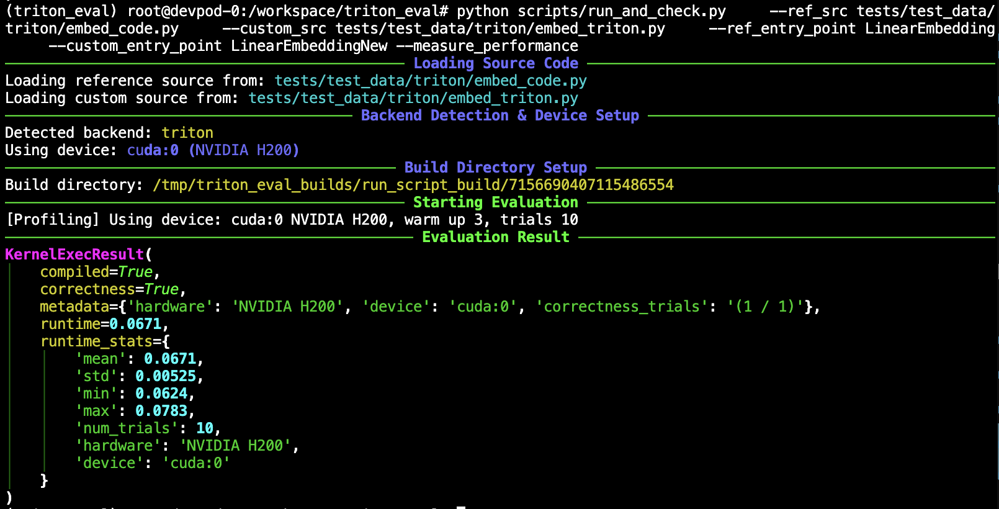

# Evaluating Custom Kernels (Cuda and Triton)

This script evaluates a custom kernel implementation (e.g., written in Triton or CUDA via Python) against a reference PyTorch implementation for correctness and optionally performance.

## Usage

Run evaluation locally:
```bash
python scripts/run_and_check.py --ref_src <path_to_ref.py> --custom_src <path_to_custom.py> [OPTIONS]
```

Run evaluation remotely using Modal:
```bash
modal run scripts/run_and_check_modal.py --ref_src <path_to_ref.py> --custom_src <path_to_custom.py> [MODAL_OPTIONS] [OPTIONS]
```


## Arguments

The scripts use `simple_parsing` for argument handling. Key arguments include paths to the reference (`--ref_src`) and custom (`--custom_src`) source files, entry point names (`--ref_entry_point`, `--custom_entry_point`), and options for performance measurement (`--measure_performance`) and verbosity (`--verbose`).

Use the `--help` flag for a full list of options for each script (e.g., `python scripts/run_and_check.py --help`).

`scripts/run_and_check_modal.py` accepts additional Modal-specific arguments like `--gpu` and `--timeout`.

## Examples

### CUDA Kernel Evaluation (Local)

```bash
python scripts/run_and_check.py \
    --ref_src tests/test_data/cuda/model_ex_add.py \
    --custom_src tests/test_data/cuda/model_new_ex_add.py
```
*(Assumes default entry point names "Model" and "ModelNew")*

### Triton Kernel Evaluation (Local)

```bash
python scripts/run_and_check.py \
    --ref_src tests/test_data/triton/embed_code.py \
    --custom_src tests/test_data/triton/embed_triton.py \
    --ref_entry_point LinearEmbedding \
    --custom_entry_point LinearEmbeddingNew \
    --measure_performance
```

### Triton Kernel Evaluation (Modal)

Run the same Triton example on an H100 GPU using Modal:
```bash
modal run scripts/run_and_check_modal.py \
    --ref_src tests/test_data/triton/embed_code.py \
    --custom_src tests/test_data/triton/embed_triton.py \
    --ref_entry_point LinearEmbedding \
    --custom_entry_point LinearEmbeddingNew \
    --gpu H100
```


This command evaluates the `LinearEmbeddingNew` module from `embed_triton.py` against the `LinearEmbedding` module from `embed_code.py`, also measuring performance.
