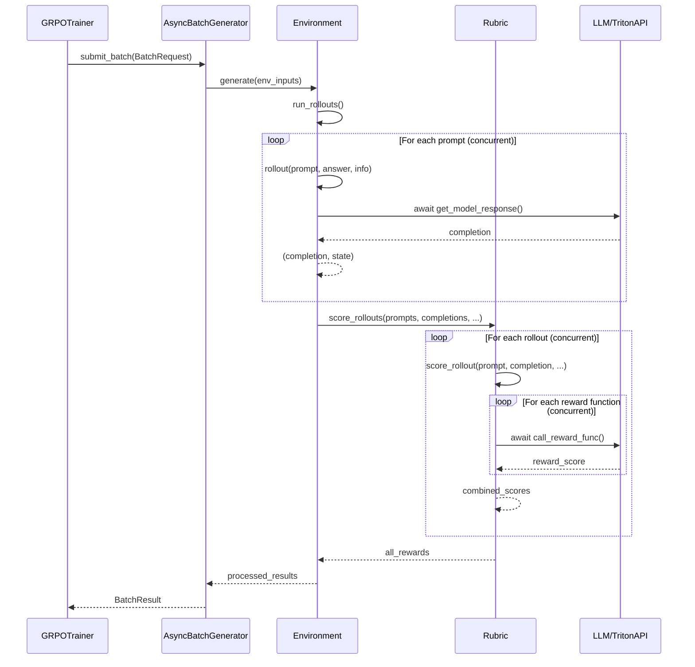

# GRPO Repeated Sampling Flow Implementation

This document explains how this GRPO implementation generates multiple different completions for each prompt when `num_generations > 1`, with emphasis on the async architecture introduced in the recent upgrade.

## Async Architecture Overview

The recent async upgrade (commit f50c3b0) introduced concurrent processing at multiple levels:



**Key Async Improvements:**
1. **Concurrent Prompt Processing**: Multiple prompts processed simultaneously via `asyncio.gather()` in `run_rollouts()`
2. **Concurrent Rubric Scoring**: Multiple rollouts scored concurrently, with reward functions for each rollout also running concurrently
3. **Non-blocking API Calls**: All LLM and API calls use async clients (`AsyncOpenAI`, async HTTP clients)

## Overview

When `num_generations > 1`, the **same prompt gets sent multiple times** to the environment, and stochastic sampling creates different completions. The system uses a `RepeatSampler` to create repeated indices, then shuffles the results before training. With the async upgrade, all these operations happen concurrently for maximum efficiency.

## Complete Flow

### 1. RepeatSampler Creates the Sampling Pattern

The `RepeatSampler` class is configured in `_get_train_sampler()` with:

```python
return RepeatSampler(
    data_source=self.train_dataset,
    mini_repeat_count=self.num_generations,  # Each prompt index repeated num_generations times
    batch_size=self.generation_batch_size // self.num_generations,
    repeat_count=self.num_iterations * self.gradient_accumulation_steps,
    shuffle=self.shuffle_dataset,
    seed=self.args.seed,
)
```

**Key insight**: `mini_repeat_count=self.num_generations` means each prompt gets repeated `num_generations` times consecutively. The `shuffle=self.shuffle_dataset` parameter shuffles the dataset indices before repeating them.

### 2. Sampling Pattern Example

From the helpful comment in the code, here's what happens with `num_generations=2`:

```
                                    |    Accum step 0     |
                                    |   GPU 0  |   GPU 1  |

               global_step   step    <-───>  num_generations=2
                                     <-───────> per_device_train_batch_size=3
grad_accum  ▲  ▲  0          0     0   0   1   1   2   2   <- Generate for prompts 0,1,2 (each repeated twice)
   =2       ▼  |  0          1     3   3   4   4   5   5   <- Generate for prompts 3,4,5 (each repeated twice)
               |
               |  1          2     6   6   7   7   8   8   <- Generate for prompts 6,7,8 (each repeated twice)
grad_accum=4▼  1          3     9   9  10  10  11  11   <- Generate for prompts 9,10,11 (each repeated twice)
```

### 3. DataLoader Returns Same Prompts Multiple Times

When the dataloader uses the repeated indices, it fetches the same prompt multiple times:

```python
# For num_generations=3, the batch might look like:
[
  {'prompt': "What is 2+2?", 'answer': "4"},
  {'prompt': "What is 2+2?", 'answer': "4"},  # Same prompt again
  {'prompt': "What is 2+2?", 'answer': "4"},  # Same prompt again  
  {'prompt': "Solve x+1=5", 'answer': "x=4"},
  {'prompt': "Solve x+1=5", 'answer': "x=4"}, # Same prompt again
  {'prompt': "Solve x+1=5", 'answer': "x=4"}  # Same prompt again
]
```

### 4. Submission to AsyncBatchGenerator

The `all_prompts` list (which contains repeated prompts) gets submitted to the AsyncBatchGenerator:

```python
request = BatchRequest(
    batch_id=batch_id,
    env_inputs={'prompt': all_prompts, 'answer': all_answers, 'task': all_tasks, 'info': all_infos},
    # ... other parameters
)
self.async_generator.submit_batch(request)
```

### 5. Environment Receives Multiple Identical Prompts

The environment receives this list of prompts where the same prompt appears multiple times:

```python
# env_inputs passed to AsyncBatchGenerator:
{
  'prompt': ["What is 2+2?", "What is 2+2?", "What is 2+2?", "Solve x+1=5", "Solve x+1=5", "Solve x+1=5"],
  'answer': ["4", "4", "4", "x=4", "x=4", "x=4"]
}
```

### 6. Async Environment Processing

The key insight is in the `run_rollouts()` method. It receives the list of prompts (including duplicates) and processes **each one concurrently** using async:

```python
async def run_rollouts(self, client, model, prompts, answers, tasks, infos, sampling_args, max_concurrent, **kwargs):
    """Run rollouts for a given list of prompts and return the completions."""
    from tqdm.asyncio import tqdm_asyncio
    rollout_tasks = [
        self.rollout(client, model, prompt, answer, task, info, sampling_args, **kwargs)
        for prompt, answer, task, info in zip(prompts, answers, tasks, infos)  # Each prompt processed concurrently
    ]
 
    return await tqdm_asyncio.gather(
        *rollout_tasks,
        total=len(prompts),
        desc=f'Running {len(prompts)} rollouts'
    )
```

### 7. Async API Calls with Stochastic Sampling

For each prompt in the list (including duplicates), the environment calls its async `rollout()` method, which eventually calls `get_model_response()`:

```python
async def rollout(self, client, model, prompt, answer, task, info, sampling_args, **kwargs):
    # ... prompt processing ...
    
    response = await self.get_model_response(
        prompt=messages,
        client=client,  # AsyncOpenAI client
        model=model,
        sampling_args=sampling_args,
        message_type=self.message_type
    )
    
    # ... completion processing ...
    return completion, state
```

The `sampling_args` from the GRPO trainer include parameters like:
- `temperature > 0` (enables randomness)
- `top_p` (nucleus sampling)  
- `top_k` (top-k sampling)
- etc.

### 8. Async Reward Computation

The rubric system processes rewards with **two levels of concurrency**:

**Level 1: Multiple rollouts scored concurrently**
```python
async def score_rollouts(self, prompts, completions, answers, states, tasks, infos, **kwargs):
    """Compute reward scores for a group of rollouts."""
    from tqdm.asyncio import tqdm_asyncio
    rollout_tasks = [
        self.score_rollout(*pcasti, **kwargs)
        for pcasti in zip(prompts, completions, answers, states, tasks, infos)
    ]
    rewards = await tqdm_asyncio.gather(
        *rollout_tasks,
        total=len(prompts),
        desc=f"Evaluating {len(prompts)} rollouts"
    )
    return {k: [item[k] for item in rewards] for k in rewards[0]}
```

**Level 2: Multiple reward functions per rollout evaluated concurrently**
```python
async def score_rollout(self, prompt, completion, answer, state, task, info, **kwargs):
    """Evaluate all reward functions asynchronously for a single rollout."""
    score_tasks = [
        self.call_reward_func(func, prompt, completion, answer, state, task, info, **kwargs)
        for func in self.get_reward_funcs()
    ]
    reward_scores = await asyncio.gather(*score_tasks)
    rewards = {func.__name__: reward for func, reward in zip(self.get_reward_funcs(), reward_scores)}
    rewards['reward'] = sum([reward * weight for reward, weight in zip(reward_scores, self.get_reward_weights())])
    return rewards
```

This dual-level concurrency means that:
- **10 rollouts × 5 reward functions = 50 concurrent operations**
- Even synchronous operations (like TritonClient HTTP calls) benefit from concurrency across rollouts and reward functions
- Total execution time ≈ max(single_rollout_time) rather than sum(all_rollout_times)

### 9. Advantage Calculation

In `_compute_advantages()`, the rewards are processed in groups:

```python
def _compute_advantages(self, rewards: torch.Tensor) -> torch.Tensor:
    # Reshape rewards to group by prompt: (num_prompts, num_generations)
    mean_grouped = rewards.view(-1, self.num_generations).mean(dim=1)
    std_grouped = rewards.view(-1, self.num_generations).std(dim=1)
    
    # Expand back to original shape for normalization
    mean_grouped = mean_grouped.repeat_interleave(self.num_generations, dim=0)
    std_grouped = std_grouped.repeat_interleave(self.num_generations, dim=0)
    
    # Compute advantages (rewards - baseline)
    advantages = rewards - mean_grouped
    
    if self.scale_rewards:
        advantages = advantages / (std_grouped + 1e-4)
    
    return advantages
```

### 10. Shuffling Before Training

After collecting all completions and computing advantages, the data is shuffled before being split for gradient accumulation:

```python
# Concatenate all data for shuffling
full_batch = {
    "prompt_ids": prompt_ids,
    "prompt_mask": prompt_mask,
    "completion_ids": completion_ids,
    "completion_mask": completion_mask,
    "old_per_token_logps": None,
    "advantages": advantages,
}

# Shuffle and split for gradient accumulation
full_batch = shuffle_tensor_dict(full_batch)
self._buffered_inputs = split_tensor_dict(full_batch, self.gradient_accumulation_steps)
```

This shuffling ensures that completions from the same prompt are mixed across different gradient accumulation steps, improving training stability.

## Async Performance Benefits

The async architecture provides significant performance improvements:

**Before Async (Sequential)**:
- Total time = sum of all API calls
- Example: 20 prompts × 2 seconds each = 40 seconds

**After Async (Concurrent)**:
- Total time ≈ max of slowest API call  
- Example: 20 prompts, slowest takes 3 seconds = ~3 seconds total
- **10-15x speedup** for typical batches

**Rubric Concurrency**:
- Even synchronous reward functions (HTTP calls to Triton server) run concurrently
- Multiple rollouts × multiple reward functions = high parallelism
- Memory and compute resources utilized efficiently

## Complete Example Flow

Let's trace a concrete example with `num_generations=3`:

### Step 1: RepeatSampler Creates Repeated Indices
```python
# Original dataset: ["What is 2+2?", "Solve x+1=5"] 
# RepeatSampler yields: [0, 0, 0, 1, 1, 1]
```

### Step 2: DataLoader Returns Repeated Prompts
```python
# Batch from dataloader:
[
  {'prompt': "What is 2+2?", 'answer': "4"},
  {'prompt': "What is 2+2?", 'answer': "4"},  # Same prompt
  {'prompt': "What is 2+2?", 'answer': "4"},  # Same prompt  
  {'prompt': "Solve x+1=5", 'answer': "x=4"},
  {'prompt': "Solve x+1=5", 'answer': "x=4"}, # Same prompt
  {'prompt': "Solve x+1=5", 'answer': "x=4"}  # Same prompt
]
```

### Step 3: Environment Receives Repeated Prompts
```python
# env_inputs passed to AsyncBatchGenerator:
{
  'prompt': ["What is 2+2?", "What is 2+2?", "What is 2+2?", "Solve x+1=5", "Solve x+1=5", "Solve x+1=5"],
  'answer': ["4", "4", "4", "x=4", "x=4", "x=4"]
}
```

### Step 4: Concurrent API Calls with Stochastic Sampling
The environment calls `rollout()` → `get_model_response()` for each prompt **concurrently**:

```python
# All calls happen simultaneously via asyncio.gather():
# Call 1: "What is 2+2?" → await client.chat.completions.create(...) → "2+2=4"
# Call 2: "What is 2+2?" → await client.chat.completions.create(...) → "Let me calculate: 2+2 equals 4"  
# Call 3: "What is 2+2?" → await client.chat.completions.create(...) → "The answer is 4"
# Call 4: "Solve x+1=5" → await client.chat.completions.create(...) → "x+1=5, so x=4"
# Call 5: "Solve x+1=5" → await client.chat.completions.create(...) → "Subtract 1: x=5-1=4"
# Call 6: "Solve x+1=5" → await client.chat.completions.create(...) → "x=4"

# Total time ≈ max(individual_call_time) instead of sum(all_call_times)
```

### Step 5: Concurrent Reward Computation
```python
# Reward computation also happens concurrently:
# - 6 rollouts scored simultaneously
# - Each rollout's reward functions (static + TritonAPI) run concurrently
# - Total scoring time ≈ max(slowest_reward_function)

# Rewards: [0.9, 0.8, 0.7, 0.6, 0.9, 0.5]
# Grouped by prompt: [[0.9, 0.8, 0.7], [0.6, 0.9, 0.5]]
# Mean per group: [0.8, 0.67]
# Advantages: [0.1, 0.0, -0.1, -0.07, 0.23, -0.17]
```

### Step 6: Shuffling Before Training
```python
# Before shuffling (grouped by prompt):
# prompt_ids: [prompt0_gen0, prompt0_gen1, prompt0_gen2, prompt1_gen0, prompt1_gen1, prompt1_gen2]
# advantages: [0.1, 0.0, -0.1, -0.07, 0.23, -0.17]

# After shuffle_tensor_dict():
# prompt_ids: [prompt1_gen1, prompt0_gen0, prompt1_gen2, prompt0_gen2, prompt1_gen0, prompt0_gen1]
# advantages: [0.23, 0.1, -0.17, -0.1, -0.07, 0.0]

# Split into gradient_accumulation_steps=2:
# Step 0: [prompt1_gen1, prompt0_gen0, prompt1_gen2]
# Step 1: [prompt0_gen2, prompt1_gen0, prompt0_gen1]
```

## Implementation Details

1. **No Special API Parameter**: The system doesn't use `n > 1` in the API call. Instead, it sends the same prompt multiple times as separate async requests.

2. **Stochastic Sampling Required**: Without `temperature > 0` or other stochastic parameters, all repeated prompts would generate identical completions.

3. **Independent Async API Calls**: Each prompt (including duplicates) gets processed as a completely separate async API call.

4. **Multi-Level Concurrency**: 
   - Environment level: Multiple prompts processed concurrently
   - Rubric level: Multiple rollouts and reward functions processed concurrently
   - HTTP level: Multiple API calls handled concurrently by async clients

5. **Two-Level Shuffling**: 
   - `RepeatSampler` shuffles dataset indices before repeating them
   - `shuffle_tensor_dict()` shuffles the final batch before splitting for gradient accumulation

6. **Async Processing Pipeline**: The `AsyncBatchGenerator` allows all stages to overlap - while one batch is being scored, the next batch can be generating completions. 